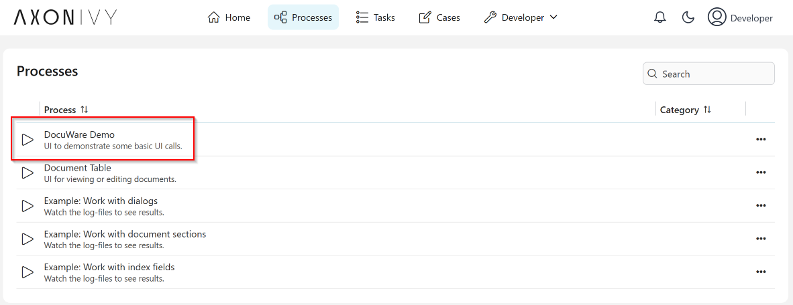
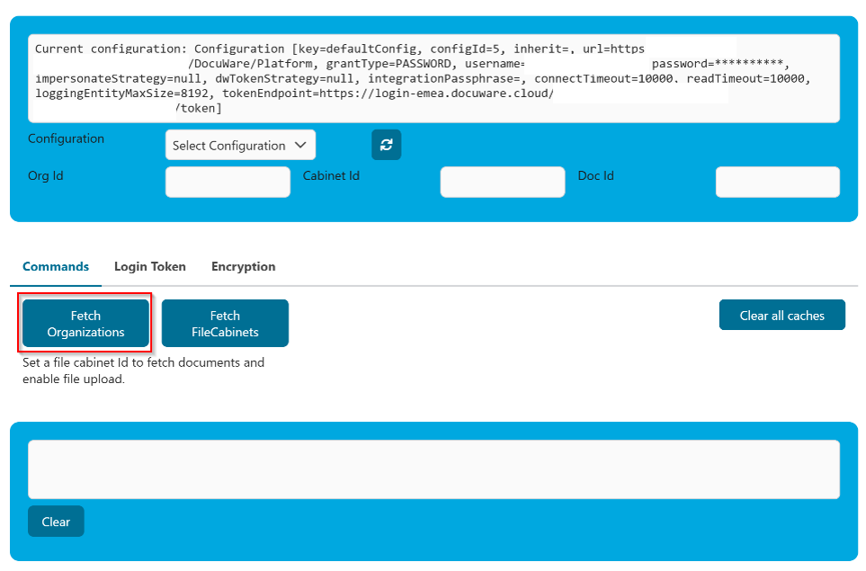
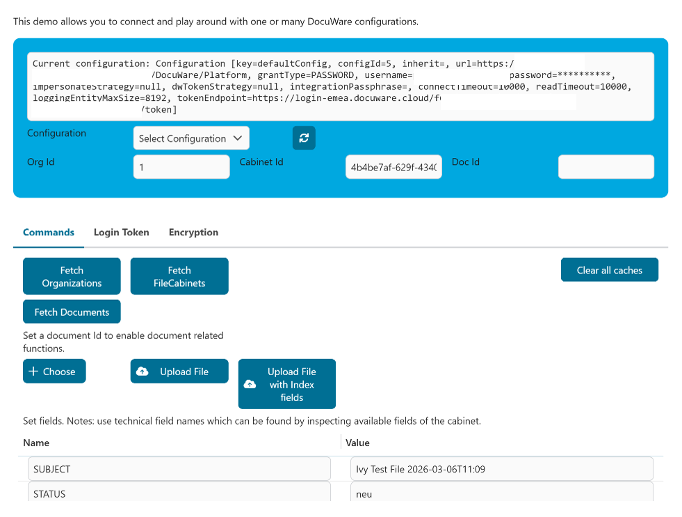
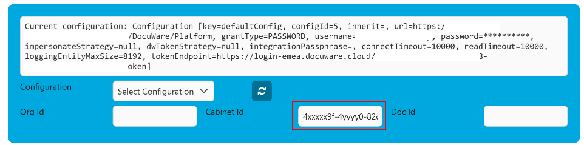
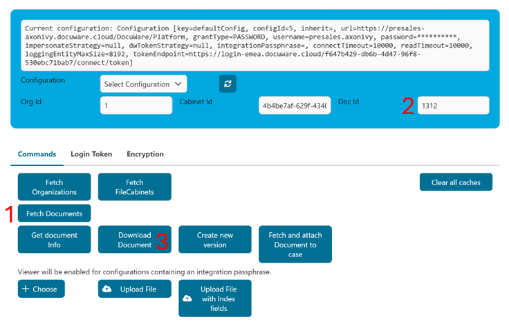
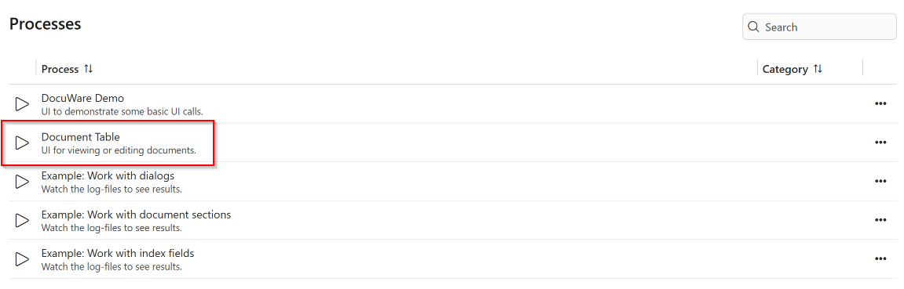
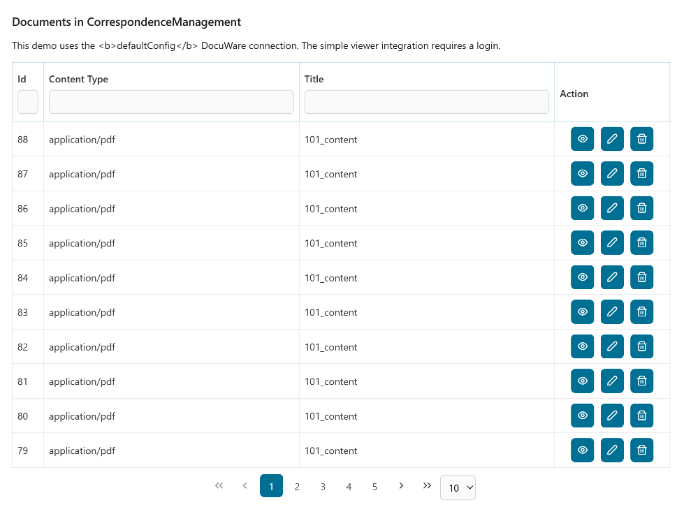
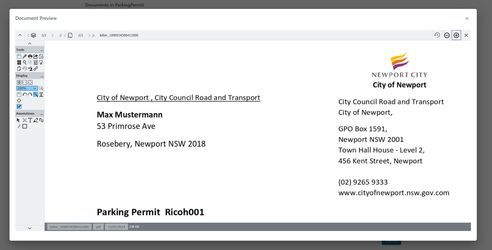
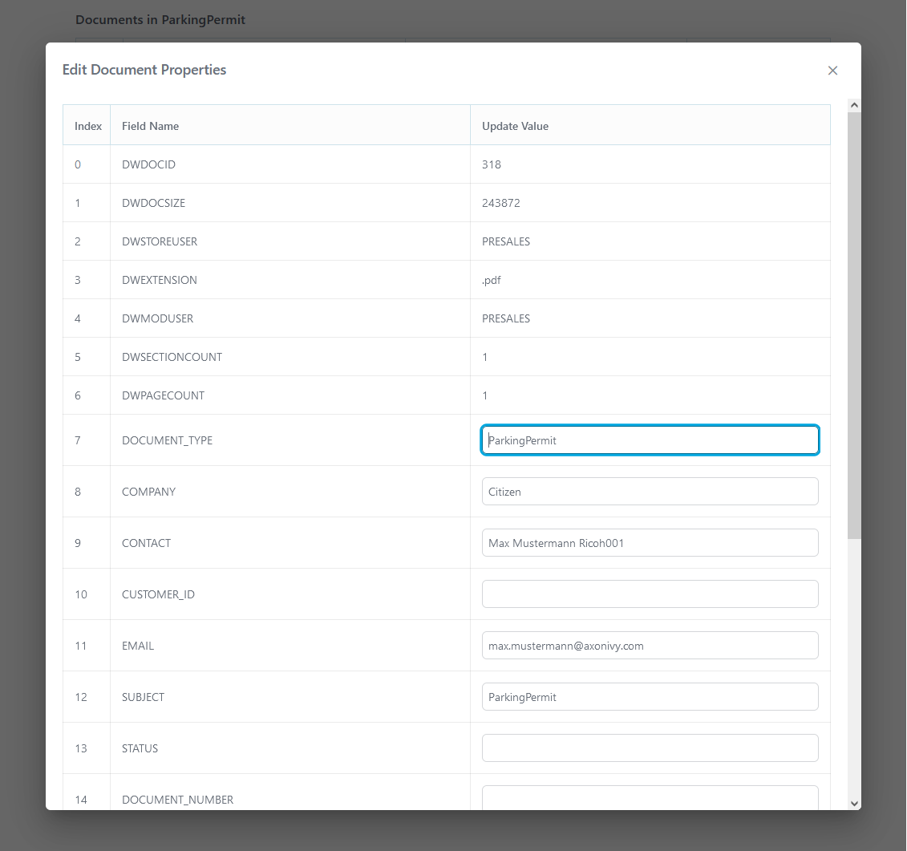
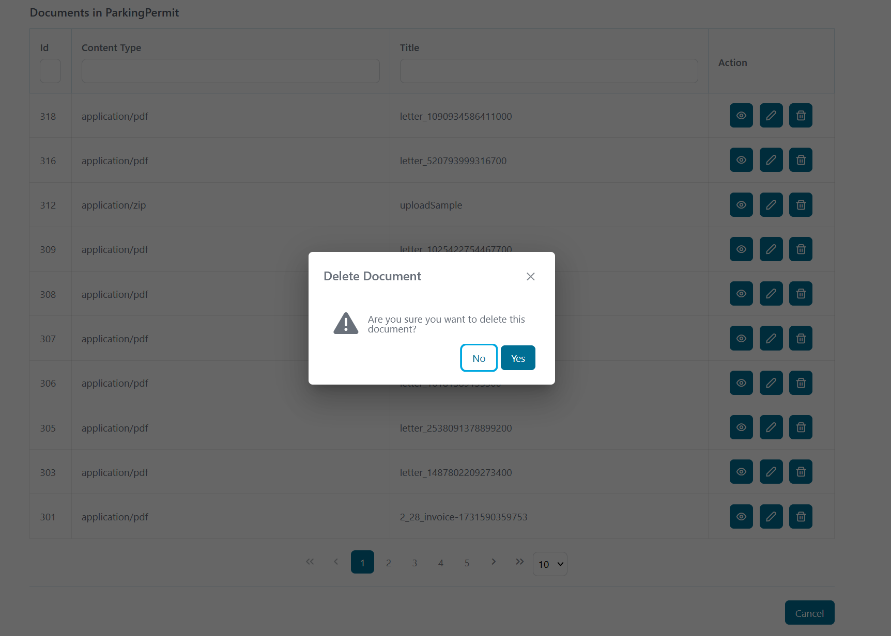

# DocuWare Connector

[DocuWare](https://start.docuware.com/) offers cloud-based document management and workflow automation software. It can be used to digitize, archive, and process any business documents in an audit-proof manner to optimize your company's core processes.

**DocuWare Organization**  
A *DocuWare Organization* is the top-level tenant in DocuWare. It represents an isolated environment that contains users, roles, configurations, and all document repositories of the organization.

**File Cabinet**  
A *File Cabinet* is a document repository within an organization. It stores documents together with their indexed metadata (fields such as invoice number, date, supplier) and enables searching, storing, and retrieving documents.

**Connector Capability**  
This connector allows you to connect **multiple DocuWare organizations**, each containing **multiple file cabinets**, within a single configuration. This makes it possible to access and manage documents across several DocuWare environments. It enables efficient integration of DocuWare functionalities into your **Axon Ivy process applications**.

This connector minimizes your integration effort by:

- Using REST web service technologies
- Fetching one or more DocuWare organizations
- Fetching file cabinets
- Providing a GUI to view and edit document properties of the default DocuWare instance
- Providing configurations to test several authentication methods

## Demo
### DocuWare Basic Demo: Fetching Organizations, File Cabinets and Documents

1. Start the DocuWare Demo Process:
   


The DocuWare Demo provides a GUI to test different DocuWare configurations. To use all demo features, multiple configurations with different grant types must be provided in `variables.yaml`. **For a basic demo (username and password based): - just provide a defaultConfig**.

#### Fetch Organizations 


If everything went well you will see `Response: Status: OK` in the textfield below the buttons. It may look like:
```
Response: Status: OK

Headers
=======
Content-Type: application/xml; charset=utf-8
Date: Fri, 06 Mar 2026 03:57:13 GMT
Cache-Control: max-age=0, private
Set-Cookie: dwingressplatform=1772769434.007.32.96427|a8466521666073443d68d0f15f64584f; Path=/; Secure; HttpOnly
Transfer-Encoding: chunked
Vary: Cookie,Accept,Accept-Encoding
Strict-Transport-Security: max-age=31536000; includeSubDomains; preload
Server-Timing: proxy-start;dur=1.5

```
#### Fetch File Cabinets
When clicking "Fetch File Cabinets", several additional buttons (features) become available.



In particular, you will get a list of available file cabinets at the bottom of your log file. It might look like this:

```
File Cabinets:
Size: 5
Id: 4b4be7af-629f-4340-82cb-126d249d2b95 - 'Awesome Filecabinet'
Id: 90b4f666-b79f-4d26-97f7-7786d8fbe4c2 - 'TEST Filecabinet'
Id: 94532ab8-a22f-4b70-a15d-ba44d916bd45 - 'Archive Cabinet'
Id: wdss996-b61c-4b4b-88fd-e506a58156278 - 'Src'
Id: 43sfsdfb137-c5a8-4ab-ae73-715e7c360f - 'Not important'
```

Choose a File Cabinet you would like to inspect further and copy its ID into the UI.



#### Fetch & download Documents


For fetching and downloading a document, click "Fetch Documents" (1) to get a list of available documents in the log viewer. You will get a list that looks like this:

```
Documents:
Size: 4
Id: 11 - 'Hello World'
Id: 10 - 'Bla'
Id: 7 - 'Umlaut.äöüÄÖÜß'
Id: 6 - 'Bla'
```
Remember the ID of the document you would like to inspect further and enter it into the UI (2). With "Download Document" (3), you can then download the document associated with this ID.

#### Further Features
- Using different configurations, i.e. for different grant types
- Getting document fields
- Downloading a document
- Creating a new version of a document
- Attaching a document to an Ivy case
- Uploading a document
- Uploading a document with index fields
- Viewing files with the embedded DocuWare viewer (if the configuration has an `integrationPassphrase` set and your DocuWare installation allows embedding in a frame - check your DocuWare's content security policy!)
- Encrypting and decrypting parameters for embedding


### Second Demo: Document Table

Make sure you have configured a File Cabinet ID in `variables.yaml`. Remember that you can fetch available File Cabinets using the first demo process (see above).

```
  # Variables used by the demo.
  docuwareWorkflow:
    fileCabinetId: ""
```

Start the  process **Document Table** to get a basic viewer showing how to add, change, view and delete documents. 



A user-friendly UI will open:



**Document Preview**

Note that previewing documents might require additional configuration of your DocuWare installation’s Content Security Policy (CSP) to allow embedding DocuWare frames into your Axon Ivy frames.



**Document Properties Editing**  
Modify document properties, including metadata and custom fields.

   

**Document Deletion**  
Delete documents from the file cabinet.

   


## Setup
Please copy  `variables.yaml` into your project.

```
@variables.yaml@
```

At least `url`, `username` and `password` must be provided.

### `configId`

Any value that identifies this version of the configuration. 

### `inherit`

Any value that is non-existent, empty, or blank in the current configuration will be looked up in the configuration referenced by this variable. The lookup is performed recursively.

### `grantType`

This is the grant-type for your configuration. Possible values are `password`, `trusted`, and `dwtoken`.

#### `password`

Grant type `password` uses a fixed `username` and `password` to connect to your DocuWare instance. All operations are performed using this user account, and all history entries will show this user. It is a simple setup using a _technical user_ to connect to a cloud or on-premise DocuWare instance.

#### `trusted`

Grant type `trusted` uses a `username` and `password` to connect as a trusted user to your DocuWare instance. Currently, DocuWare supports trusted users only for on-premise installations. The trusted user is not used directly, but impersonates another user. Which user to impersonate can be configured in the global variable `impersonateUser`.

`impersonateUser` implements a special syntax to define which user to use for accesses by anonymous Ivy user, accesses by the system Ivy user and accesses by other Ivy users:

- Use a constant username in all situations
- Use constant usernames for anonymous and system users, but the Ivy username for others
- Set the username in the user's session before making any calls and use this name

There is additional documentation in the `variables.yaml` file.

#### `dwtoken`

The token is generated by using an existing token of DocuWare. Note: This use-case is probably not fully supported. Which token to use is configured in `dwToken`. Currently, the existing token can only be loaded from the session.

### Other configuration variables

Other configuration variables are documented directly in the variables supported by the connector. Please see there for a description and copy it to your project, if you are using it, so that it will be visible in the Engine cockpit for your application.

```
@variables.yaml@
```

### Using a single DocuWare instance

If you only work with one instance you should name it `defaultConfig` and it will be used automatically without any additional considerations.

### Using multiple DocuWare instances simultaneously

If you work with multiple instances, every call must know which instance to use. Therefore, all instance-specific sub processes offered by this connector offer an additional `configKey` parameter which must be set to the name of the configuration to use in this sub-process. If the `configKey` is empty, the `defaultConfig` will be used automatically.

If you want to use REST calls of this connector directly, you can use the call's property `configKey` in the same way. Have a look at the instance-aware sub-processes to see how this is done!

### Breaking changes in this version

* Global variables configuration changed to support multiple instances.
* It is no longer possible to define a file cabinet id or other defaults for DocuWare items in the global variables of a configuration. If needed, please move these global variables to your project.
* Error handling was changed to standard AxonIvy error handling, i.e. sub-processes no longer return an error object, but rather throw exceptions in the case of errors.


