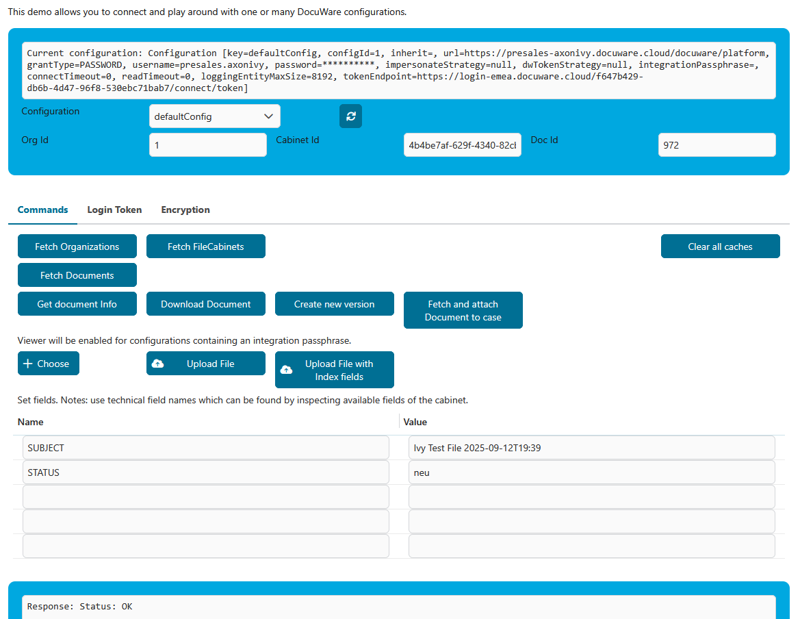

# DocuWare Connector

[DocuWare](https://start.docuware.com/) offers cloud-based document management and workflow automation software. It can be used to digitize, archive and process any business documents in an audit-proof manner to optimize your company's core processes.

**DocuWare Organization**  
A *DocuWare Organization* is the top-level tenant in DocuWare. It represents an isolated environment that contains users, roles, configurations, and all document repositories.

**File Cabinet**  
A *File Cabinet* is a document repository within an organization. It stores documents together with their indexed metadata (fields such as invoice number, date, supplier) and enables searching, storing, and retrieving documents.

**Connector Capability**  
This connector allows you to connect **multiple DocuWare organizations**, each containing **multiple file cabinets**, within a single configuration. This makes it possible to access and manage documents across several DocuWare environments. It enables efficient integration of DocuWare functionalities into your **Axon Ivy process applications**.

This connector minimizes your integration effort by:

- Using REST web service technologies
- Fetching one or multiple DocuWare organizations
- Fetching file cabinets
- Providing a GUI to view and edit document properties of the default DocuWare instance
- Providing configurations to test several authentication methods

### Docuware Demo
1. Start the DocuWare Demo Process:
   


The DocuWare Demo provides a GUI to test different DocuWare configurations. To use all demo features, multiple configurations with different grant types must be provided in `variables.yaml`. **For a basic demo (username & password based - just provide a defaultConfig**).

Click "Fech Organizations": 


If everything went well you will see `Response: Status: OK` in the textfield below the buttons. It may look like:
```
Response: Status: OK

Headers
=======
Content-Type: application/xml; charset=utf-8
Date: Fri, 06 Mar 2026 03:57:13 GMT
Cache-Control: max-age=0, private
Set-Cookie: dwingressplatform=1772769434.007.32.96427|a8466521666073443d68d0f15f64584f; Path=/; Secure; HttpOnly
Transfer-Encoding: chunked
Vary: Cookie,Accept,Accept-Encoding
Strict-Transport-Security: max-age=31536000; includeSubDomains; preload
Server-Timing: proxy-start;dur=1.5

```

When clicking "Fetch FileCabinets" a couple of more buttons (features) are available - now you can also fetch documents:


The following functions can be tested:

- Using different configurations
- Using configuration of grant type `dwtoken` with a provided or generated login token
- Fetching organizations
- Fetching cabinets
- Fetching documents
- Getting document fields
- Downloading a document
- Creating a new version of a document
- Attaching a document to an Ivy case
- Uploading a document
- Uploading a document with index fields
- Viewing files with the embedded DocuWare viewer (if the configuration has an `integrationPassphrase` set and your DocuWare installation allows embedding in a frame - check your DocuWare's content security policy!)
- Encrypting and decrypting parameters for embedding



### Document Table

Start **Document Table** to get a basic viewer showing how to add, change, view and delete documents. Note that viewing documents might require additional setup of your DocuWare installation's content security policy to allow embedding of DocuWare frames into your AxonIvy frames.

   

**Document Properties Editing**  
Modify document properties, including metadata and custom fields.

   

**Document Deletion**  
Delete documents from the file cabinet.

   

### Other demos

Other process starts show examples of DocuWare usage.

## Setup
Please copy  `variables.yaml` into your project.

```
@variables.yaml@
```

At least `url`, `username` and `password` must be provided. For an initial configuration delete 

### `configId`

Any value that identifies this version of the configuration. If the value changes, the cached configuration will be re-read the next time it is needed. It might be a good idea to include a timestamp and the username of the person making the change.

### `inherit`

Any value which is **non-existent, empty or blank** in the current configuration will be looked up in the configuration mentioned in this variable. The lookup will be done recursively.

### `grantType`

This is the grant-type of your configuration. Possible values are `password`, `trusted`, and `dwtoken`.

#### `password`

Grant type `password` uses a fixed `username` and `password` to connect to your DocuWare instance. This means that all operations will be performed by this user. Also, all history entries will show this user. It is a simple setup for a _technical user_ to connect to a cloud or on-premise instance of DocuWare.

#### `trusted`

Grant type `trusted` uses a `username` and `password` to connect as a trusted user to your DocuWare instance. Currently, DocuWare supports trusted users only for on-premise installations. The trusted user is not used directly, but impersonates another user. Which user to impersonate can be configured in the global variable `impersonateUser`.

`impersonateUser` implements a special syntax to define which user to use for accesses by anonymous Ivy user, accesses by the system Ivy user and accesses by other Ivy users:

- Using a constant username for all situations
- Using constant usernames for anonymous and system, but using the Ivy username for others
- Setting the username to use in the user's session before any calls and using this name

Please see the documentation in the `variables.yaml` file.

#### `dwtoken`

The token is generated by using an existing token of DocuWare. Note: This use-case is probably not fully supported. Which token to use is configured in `dwToken`. Currently, the existing token can only be loaded from the session.

### Other configuration variables

Other configuration variables are documented directly in the variables supported by the connector. Please see there for a description and copy it to your project, if you are using it, so that it will be visible in the Engine cockpit for your application.

```
@variables.yaml@
```

### Using a single DocuWare instance

If you only work with one instance you should name it `defaultConfig` and it will be used automatically without any additional considerations.

### Using multiple DocuWare instances simultaneously

If you work with multiple instances, every call must know which instance to use. Therefore, all instance-specific sub processes offered by this connector offer an additional `configKey` parameter which must be set to the name of the configuration to use in this sub-process. If the `configKey` is empty, the `defaultConfig` will be used automatically.

If you want to use REST calls of this connector directly, you can use the call's property `configKey` in the same way. Have a look at the instance-aware sub-processes to see how this is done!

### Breaking changes in this version

* Global variables configuration changed to support multiple instances.
* It is no longer possible to define a file cabinet id or other defaults for DocuWare items in the global variables of a configuration. If needed, please move these global variables to your project.
* Error handling was changed to standard AxonIvy error handling, i.e. sub-processes no longer return an error object, but rather throw exceptions in the case of errors.

### Missing something?

If the connector is missing features that you need, you can unpack it to your project and extend it there. In this case, consider proposing/offering your change to the Axon Ivy market.

