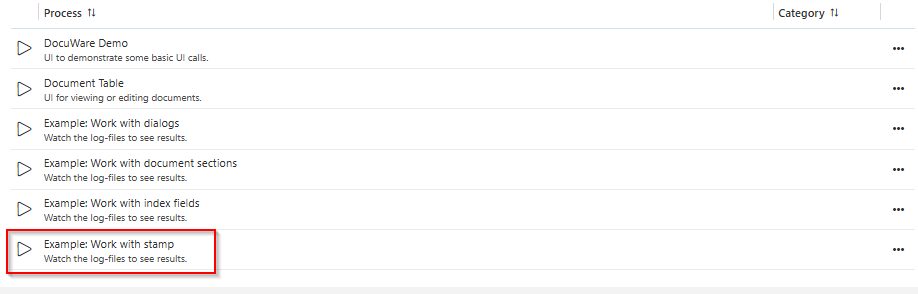
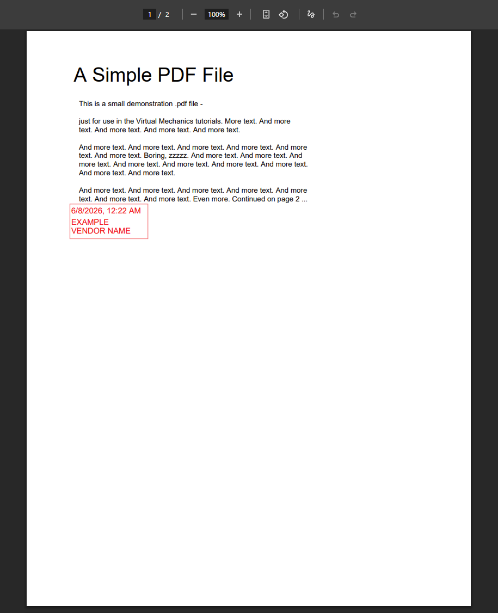

# DocuWare Connector

The DocuWare Connector integrates DocuWare document management with Axon Ivy, enabling seamless document workflows directly from your Axon Ivy processes.


With this connector, you can manage your documents and document workflows programmatically—upload files with metadata, download documents, query file cabinets, apply stamps and signatures, and transfer documents between cabinets—all with simple callable subprocesses that integrate natively into your Ivy applications.

**Key features**

- **Document Management** — Upload files with index field metadata and manage documents programmatically
- **Document Retrieval** — Download documents and check them out from DocuWare file cabinets on demand
- **Metadata Operations** — Query and update document properties and index fields in DocuWare
- **Document Organization** — Transfer documents between file cabinets and delete unwanted documents
- **Stamp & Signature** — Apply predefined stamps and annotations to documents programmatically
- **Configuration Flexibility** — Support for multiple DocuWare server configurations with flexible authentication (password, trusted, token-based)

## Demo
### DocuWare Basic Demo: Fetching Organizations, File Cabinets and Documents

1. Start the DocuWare Demo Process:
   


The DocuWare Demo provides a GUI to test different DocuWare configurations. To use all demo features, multiple configurations with different grant types must be provided in `variables.yaml`. **For a basic demo (username and password based): - just provide a defaultConfig**.

#### Fetch Organizations 


If everything went well you will see `Response: Status: OK` in the textfield below the buttons. It may look like:
```
Response: Status: OK

Headers
=======
Content-Type: application/xml; charset=utf-8
Date: Fri, 06 Mar 2026 03:57:13 GMT
Cache-Control: max-age=0, private
Set-Cookie: dwingressplatform=1772769434.007.32.96427|a8466521666073443d68d0f15f64584f; Path=/; Secure; HttpOnly
Transfer-Encoding: chunked
Vary: Cookie,Accept,Accept-Encoding
Strict-Transport-Security: max-age=31536000; includeSubDomains; preload
Server-Timing: proxy-start;dur=1.5

```
#### Fetch File Cabinets
When clicking "Fetch File Cabinets", several additional buttons (features) become available.


In particular, you will get a list of available file cabinets at the bottom of your log file. It might look like this:

```
File Cabinets:
Size: 5
Id: 4b4be7af-629f-4340-82cb-126d249d2b95 - 'Awesome Filecabinet'
Id: 90b4f666-b79f-4d26-97f7-7786d8fbe4c2 - 'TEST Filecabinet'
Id: 94532ab8-a22f-4b70-a15d-ba44d916bd45 - 'Archive Cabinet'
Id: wdss996-b61c-4b4b-88fd-e506a58156278 - 'Src'
Id: 43sfsdfb137-c5a8-4ab-ae73-715e7c360f - 'Not important'
```

Choose a File Cabinet you would like to inspect further and copy its ID into the UI.


#### Fetch & download Documents


For fetching and downloading a document, click "Fetch Documents" (1) to get a list of available documents in the log viewer. You will get a list that looks like this:

```
Documents:
Size: 4
Id: 11 - 'Hello World'
Id: 10 - 'Bla'
Id: 7 - 'Umlaut.äöüÄÖÜß'
Id: 6 - 'Bla'
```
Remember the ID of the document you would like to inspect further and enter it into the UI (2). With "Download Document" (3), you can then download the document associated with this ID.

#### Further Features
- Using different configurations, i.e. for different grant types
- Getting document fields
- Downloading a document
- Creating a new version of a document
- Attaching a document to an Ivy case
- Uploading a document
- Uploading a document with index fields
- Viewing files with the embedded DocuWare viewer (if the configuration has an `integrationPassphrase` set and your DocuWare installation allows embedding in a frame - check your DocuWare's content security policy!)
- Encrypting and decrypting parameters for embedding


### Second Demo: Document Table

Make sure you have configured a File Cabinet ID in `variables.yaml`. Remember that you can fetch available File Cabinets using the first demo process (see above).

```
  # Variables used by the demo.
  docuwareWorkflow:
    fileCabinetId: ""
```

Start the  process **Document Table** to get a basic viewer showing how to add, change, view and delete documents. 


A user-friendly UI will open:


**Document Preview**

Note that previewing documents might require additional configuration of your DocuWare installation’s Content Security Policy (CSP) to allow embedding DocuWare frames into your Axon Ivy frames.


**Document Properties Editing**
Modify document properties, including metadata and custom fields.

   

**Document Deletion**
Delete documents from the file cabinet.

   

### Stamp Demo

Start the **Stamp** demo from its process start link.

   

1. The demo fetches the stamp templates that the current account is allowed to use. The result is printed to the log, for example:

```
***DocuWareDemo-Stamp - Found Stamps: 3
Stamp id=xxxx-xxxx-xxxx-xxxx-xxxxxxxxxxxx, name=ABC-AP1
Stamp id=yyyy-yyyy-yyyy-yyyy-yyyyyyyyyyyy, name=ABC-AP2
Stamp id=zzzz-zzzz-zzzz-zzzz-zzzzzzzzzzzz, name=ABC-AP3
```

2. The demo uploads a document and applies a stamp on it using the first stamp template.
3. Finally, the stamped document is downloaded and attached to the Ivy case.

   

### Other demos

Other process starts show examples of DocuWare usage.

## Setup

- **Roles:** Everybody (configured in config/roles.xml)
- **OpenAPI:** Spec URL
- **REST Client Configuration:** The connector uses the DocuWare REST API (OpenAPI specification) defined in the rest-clients.yaml configuration

1. **Install the connector** — Add the docuware-connector artifact to your Ivy project via Maven
2. **Configure DocuWare connection** — Edit `config/rest-clients.yaml` and set the DocuWare server URL and API credentials in the `DocuWare` rest client configuration
3. **Set authentication** — Choose your preferred authentication method (password, trusted, or token-based) by configuring the `grantType` variable in `config/variables.yaml`
4. **Provide credentials** — Store your DocuWare username and password (or token) in the configuration, encrypted for security
5. **Optional: Multi-environment setup** — Create environment-specific `variables.yaml` files in subdirectories if you need different configurations for development, staging, and production.
    - In Demo section, you need to add **url** into **trustedUser** to run demo process. For example:
    ```
     trustedUser:
        url: "https://put.here.your.url/DocuWare/Platform"
    ```
6. **Verify connection** — Run one of the demo workflows to confirm your DocuWare server connection is working correctly
7. **Integrate callable subs** — Call the DocuWare connector callable subprocesses from your own processes to upload, download, query, or update documents

### Variables

```
@variables.yaml@
```

## Components

### Callable Subprocesses

#### CheckinService.p.json

- **Signature**: checkOutToFileSystem(String, String, String) -> file: File
    - Input:
        - `configKey` (String) - REST client configuration key identifying the DocuWare connection from rest-clients.yaml
        - `documentId` (String) - The unique identifier of the document to download
        - `fileCabinetId` (String) - The unique identifier of the file cabinet containing the document
    - Result:
        - `file` (File) - Local file downloaded from DocuWare

- **Signature**: checkOutToFileSystem(String, String, String, Boolean) -> file: File
    - Input:
        - `configKey` (String) - REST client configuration key identifying the DocuWare connection from rest-clients.yaml
        - `documentId` (String) - The unique identifier of the document to download
        - `fileCabinetId` (String) - The unique identifier of the file cabinet containing the document
        - `checkOutAsStream` (Boolean) - Flag to determine whether to checkout as stream or file
    - Result:
        - `file` (File) - Local file downloaded from DocuWare

#### DeleteService.p.json

- **Signature**: deleteDocument(String, String, String) -> (none)
    - Input:
        - `configKey` (String) - REST client configuration key identifying the DocuWare connection from rest-clients.yaml
        - `documentId` (String) - The unique identifier of the document to delete
        - `fileCabinetId` (String) - The unique identifier of the file cabinet containing the document
    - Result: (none)

#### DownloadService.p.json

- **Signature**: downloadFile(String, String, String) -> file: File
    - Input:
        - `configKey` (String) - REST client configuration key identifying the DocuWare connection from rest-clients.yaml
        - `documentId` (String) - The unique identifier of the document to download
        - `fileCabinetId` (String) - The unique identifier of the file cabinet containing the document
    - Result:
        - `file` (File) - Local file downloaded from DocuWare

#### StampService.p.json

- **Signature**: addStamp(String, String, String, List<String>, String) -> annotations: com.docuware.dev.schema._public.services.platform.DocumentAnnotations
    - Input:
        - `configKey` (String) - REST client configuration key to identify the DocuWare server connection from rest-clients.yaml
        - `documentId` (String) - The unique identifier of the document where the stamp will be applied
        - `fileCabinetId` (String) - The unique identifier of the file cabinet where the document resides
        - `stampFieldValues` (List<String>) - Dynamic text values for stamp form fields (e.g., signer name, date, etc.)
        - `stampPassword` (String) - Optional password required to apply password-protected stamps
    - Result:
        - `annotations` (com.docuware.dev.schema._public.services.platform.DocumentAnnotations) - Document annotations after stamp application

#### TransferService.p.json

- **Signature**: moveDocument(String, String, String, String) -> result: com.docuware.dev.schema._public.services.platform.DocumentsQueryResult
    - Input:
        - `configKey` (String) - REST client configuration key identifying the DocuWare connection from rest-clients.yaml
        - `documentId` (String) - The unique identifier of the document to move
        - `sourceFileCabinetId` (String) - The unique identifier of the source file cabinet containing the document
        - `targetFileCabinetId` (String) - The unique identifier of the target file cabinet to move the document into
    - Result:
        - `result` (com.docuware.dev.schema._public.services.platform.DocumentsQueryResult) - Result object containing the document query response

#### UpdateService.p.json

- **Signature**: updateDocumentIndexFields(String, String, String, List<com.axonivy.connector.docuware.connector.DocuWareProperty>) -> (none)
    - Input:
        - `configKey` (String) - REST client configuration key identifying the DocuWare connection from rest-clients.yaml
        - `documentId` (String) - The unique identifier of the document to update
        - `fileCabinetId` (String) - The unique identifier of the file cabinet containing the document
        - `indexFields` (List<com.axonivy.connector.docuware.connector.DocuWareProperty>) - List of DocuWare index field assignments to update
    - Result: (none)

#### UploadService.p.json

- **Signature**: uploadFileWithIndexFields(String, String, File, List<com.axonivy.connector.docuware.connector.DocuWareProperty>, String) -> document: com.docuware.dev.schema._public.services.platform.Document
    - Input:
        - `configKey` (String) - REST client configuration key identifying the DocuWare connection from rest-clients.yaml
        - `fileCabinetId` (String) - The unique identifier of the file cabinet where the document should be uploaded
        - `file` (File) - Local file object whose content is uploaded to the selected DocuWare file cabinet
        - `indexFields` (List<com.axonivy.connector.docuware.connector.DocuWareProperty>) - List of DocuWare index field assignments
        - `storeDialogId` (String) - Optional store dialog identifier used by DocuWare when storing the document
    - Result:
        - `document` (com.docuware.dev.schema._public.services.platform.Document) - Created DocuWare document metadata

- **Signature**: uploadFileWithIndexFields(String, String, InputStream, String, List<com.axonivy.connector.docuware.connector.DocuWareProperty>, String) -> document: com.docuware.dev.schema._public.services.platform.Document
    - Input:
        - `configKey` (String) - REST client configuration key identifying the DocuWare connection from rest-clients.yaml
        - `fileCabinetId` (String) - The unique identifier of the file cabinet where the document should be uploaded
        - `fileStream` (java.io.InputStream) - Input stream containing the binary file data to upload
        - `fileName` (String) - Filename to assign to the uploaded document
        - `indexFields` (List<com.axonivy.connector.docuware.connector.DocuWareProperty>) - List of DocuWare index field assignments
        - `storeDialogId` (String) - Optional store dialog identifier used by DocuWare
    - Result:
        - `document` (com.docuware.dev.schema._public.services.platform.Document) - Created DocuWare document metadata

### Dialog Components

- For this market extension we do not provide any Dialog Components.

### Rest Clients

- **OpenAPI:** [DocuWare API specification](file:///X:/AxonIvy/marketplace/docuware/openapi-handmade.json)

### Web Services

- For this market extension we do not provide any Web Services.

### Maven Artifacts

1. docuware-connector

```xml
<dependency>
    <groupId>com.axonivy.connector.docuware</groupId>
    <artifactId>docuware-connector</artifactId>
    <type>iar</type>
</dependency>
```

2. docuware-connector-demo *(optional)*

```xml
<dependency>
    <groupId>com.axonivy.connector.docuware</groupId>
    <artifactId>docuware-connector-demo</artifactId>
    <type>iar</type>
</dependency>
```
