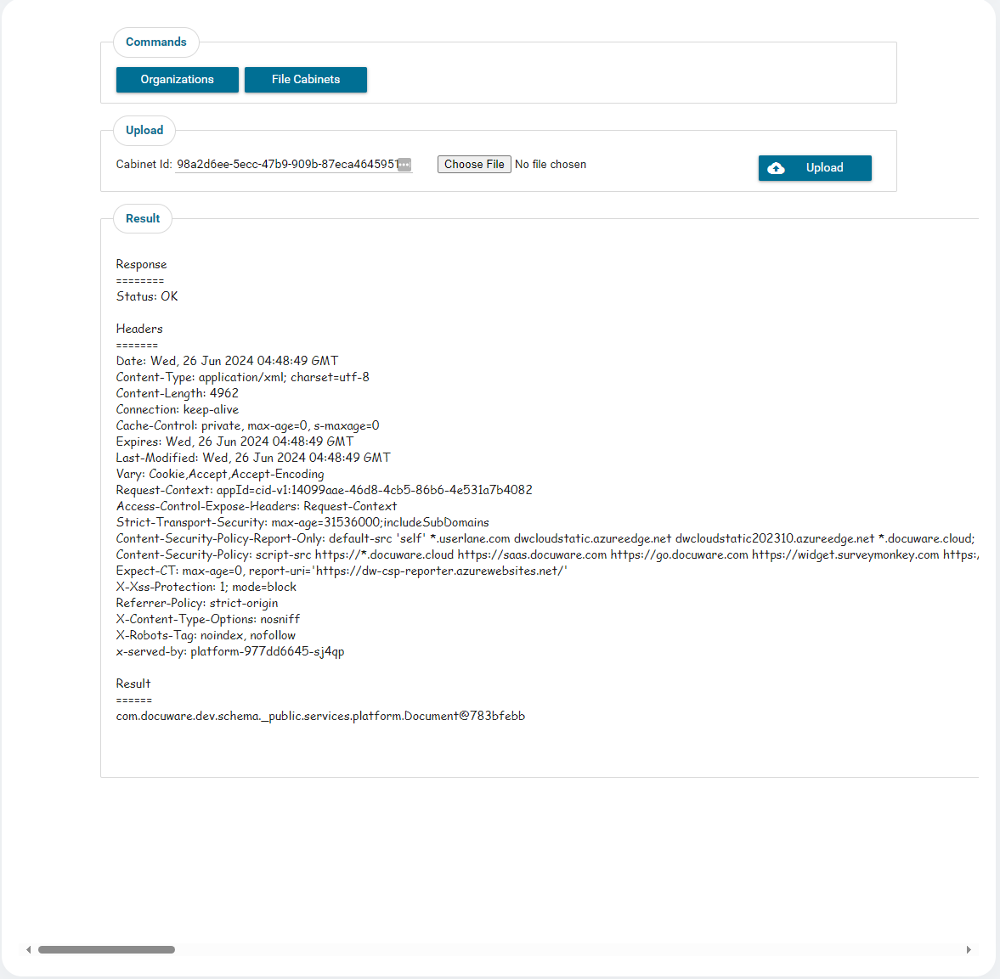
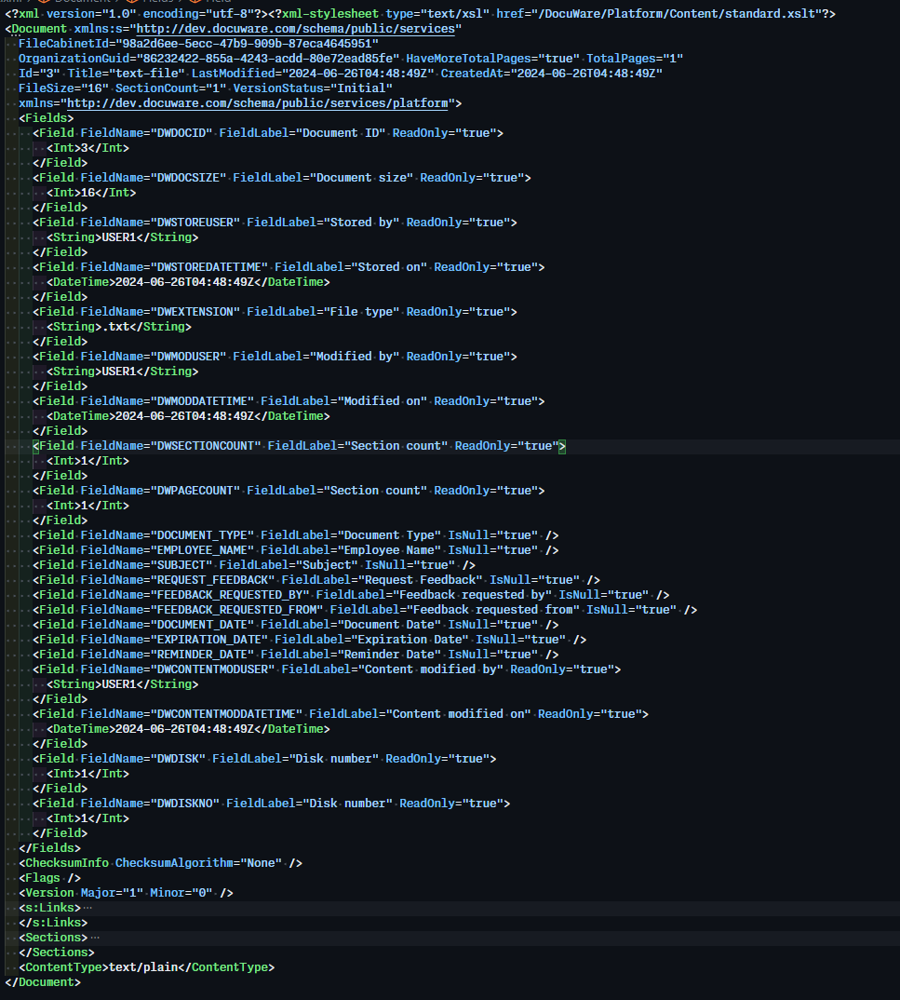
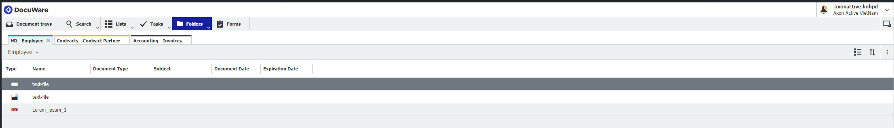
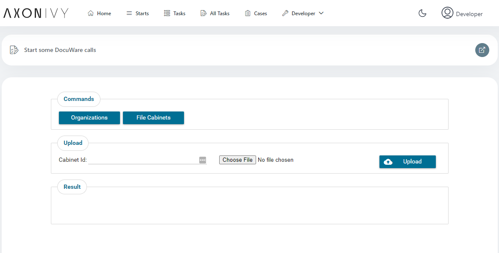
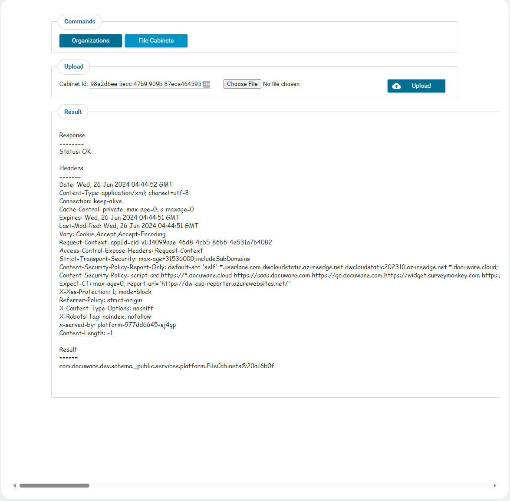

# DocuWare Konnektor

 [DocuWare](https://start.docuware.com/) bietet Cloud-basiertes Dokumenten-Management und Software zur Workflow-Automation. Damit lassen sich beliebige Geschäftsdokumente digitalisieren, revisionssicher archivieren und bearbeiten, um so die Kernprozesse deines Unternehmens zu optimieren.

**Der Axon Ivy DocuWare Konnektor ermöglicht eine effiziente Integration von DocuWare Funktionalitäten in Deine Prozessanwendungen**

Dieser Konnektor:

- minimiert deinen Integrationsaufwand: Nutze die Demoversion, die Beispiele für die API-Aufrufe enthält.
- basiert auf REST-Webservice-Technologien.
- ermöglicht dir den Zugriff auf grundlegende DocuWare-Funktionen.

## Demo

1. Ein Dokument in ein DocuWare-Archiv hochladen

Ergebnis des Uploads:





Das hochgeladene Dokument im DocuWare-Dashboard:



2. Eine Benutzeroberfläche bereitstellen, um grundlegende DocuWare-API-Aufrufe zu testen



Beispiel: Organisationen abrufen - Klicke auf den Button „Organizations“, um die Organisation-ID zu erhalten. Diese wird automatisch in die Upload-Anfrage eingefügt.


Beispiel: Archive abrufen - Klicke auf den Button „File Cabinets“, um die Archiv-ID der Organisation zu erhalten und das Zielarchiv für den Datei-Upload festzulegen.



## Einrichtung

Damit eine Interaktion zwischen der Axon Ivy Engine und den DocuWare-Diensten möglich ist, müssen diese miteinander verbunden werden. Dies erfolgt wie folgt:

1. Erstelle ein DocuWare-Konto bei der DocuWare Cloud und notiere die Zugangsdaten: `host-name`, `user-name`, `password` and `host-id` to use.

2. Überschreibe die globalen Variablen `host-name`, `user-name`, `password` und `host-id` im Demoprojekt wie im folgenden Beispiel:

```
Variables:
  
  docuware-connector:
  
    host: <myhost>.docuware.cloud

    username: <myuser>
  
    # [password]
    password: <mypass>
    
    hostid: <mhostid>
```

3. DocuWare unterstützt 3 Wege, um ein Access Token vom Identity Service zu generieren:

    3.a Token anfordern durch Benutzername & Passwort - GrantType ist `password`

    3.b Token anfordern durch ein DocuWare-Token - GrantType ist `dwtoken`

    3.c Token anfordern durch Username & Passwort (Trusted User) - GrantType ist `trusted`

4. Für deb GrantType wird der `dwtoken` verwendet, hier müssen wir einen LoginToken bekommen. Bitte starte den Prozess startRequestALoginToken.ivp und folge der Anleitung, um einen neuen LoginToken zu erzeugen

Falls deine REST-URL nicht dem vordefinierten URL-Muster des Konnektors entspricht, kannst du sie wie folgt anpassen. Im Engine Cockpit: Passe die URL direkt in der Konfiguration der Engine an. Im Designer: Entpacke das Konnektor-Projekt und ändere die URL manuell in den entsprechenden Dateien.

Um deine Einrichtung zu überprüfen, führe den Prozess start.ivp aus dem DocuWare-Demo-Projekt aus. Dies stellt sicher, dass die Integration korrekt funktioniert.


