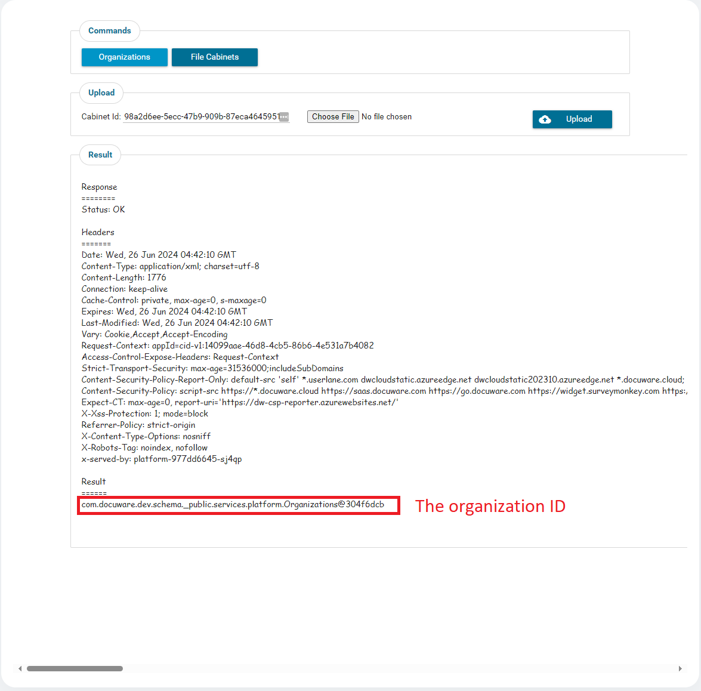
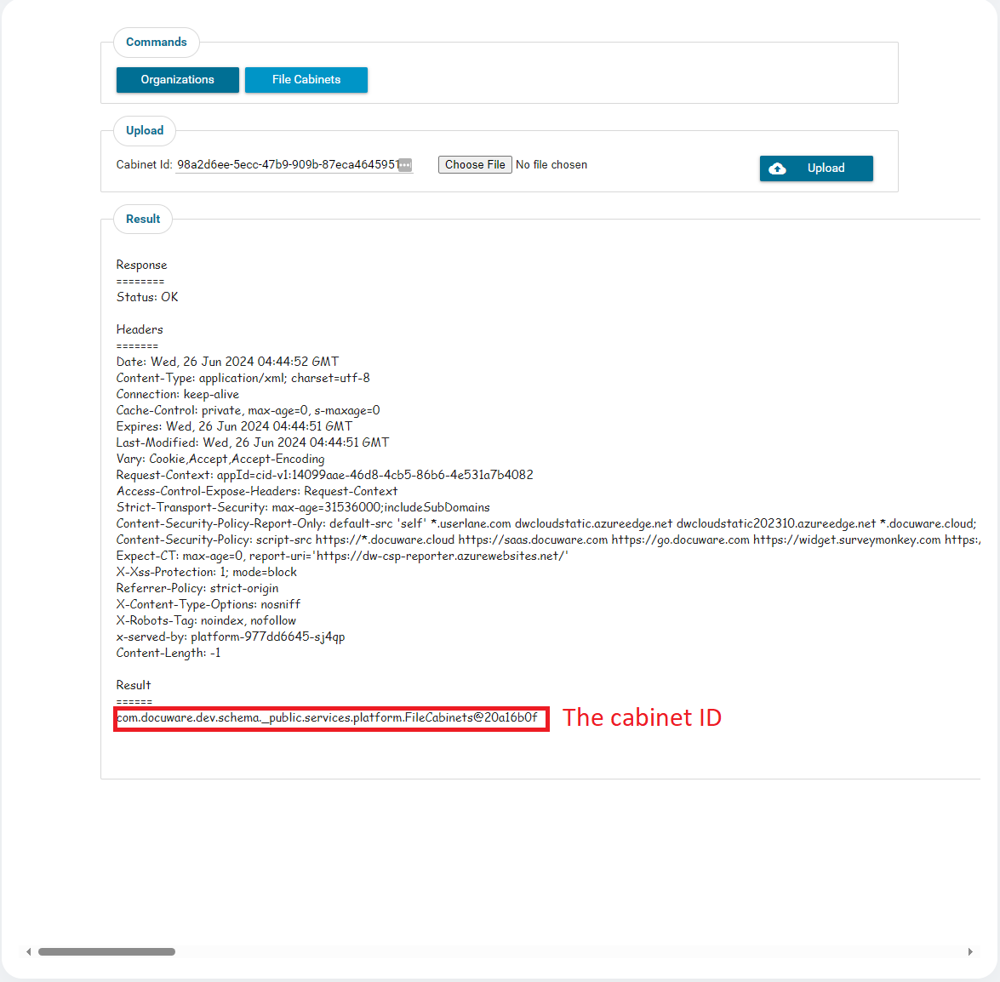
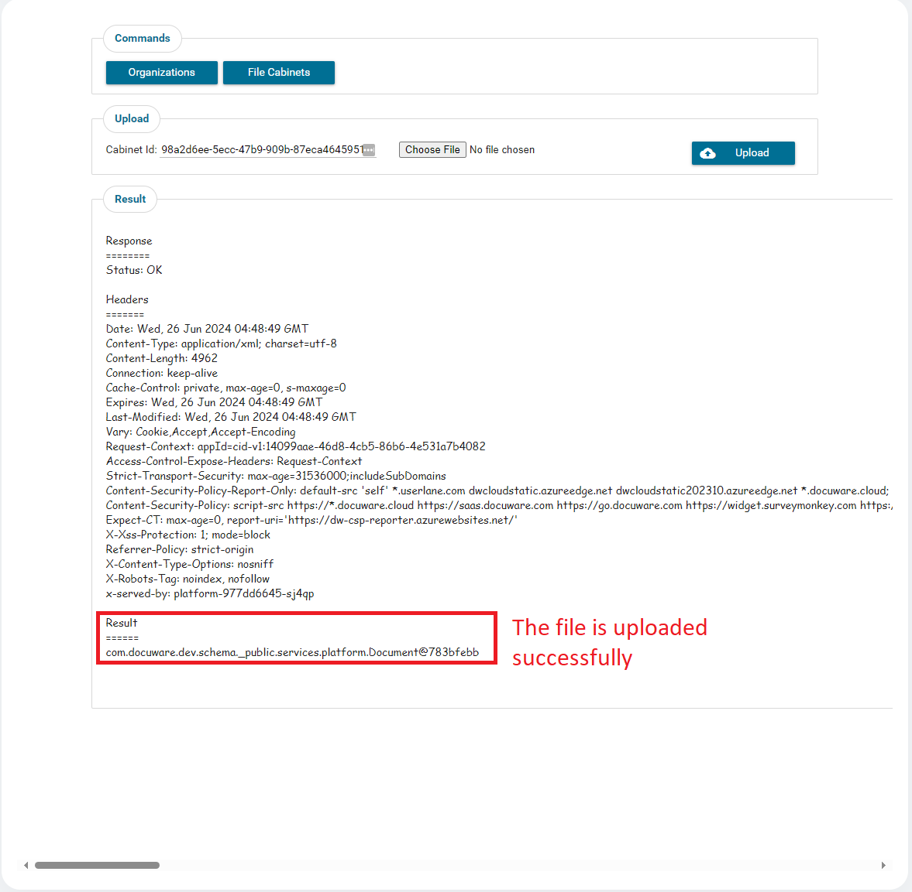
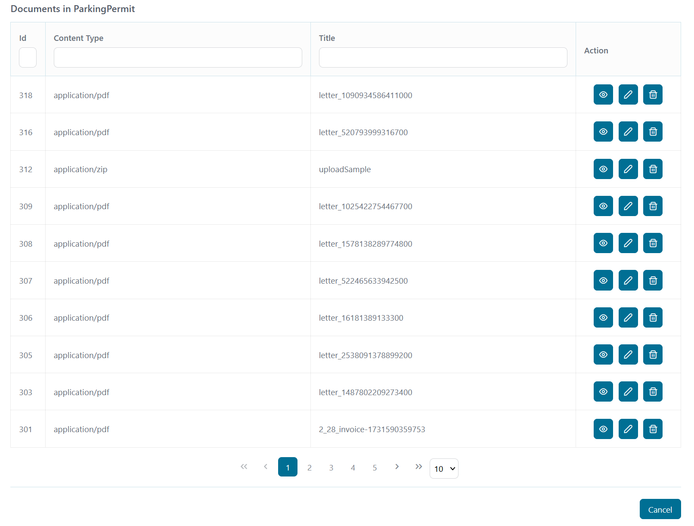

# DocuWare Connector

Der DocuWare Connector integriert DocuWare-Dokumentverwaltung mit Axon Ivy und ermöglicht nahtlose Dokumentworkflows direkt aus Ihren Axon Ivy-Prozessen.


Mit diesem Connector kannst du deine Dokumente und Dokumentworkflows programmgesteuert verwalten – Dateien mit Metadaten hochladen, Dokumente herunterladen, Aktenschränke abfragen, Stempel und Signaturen anwenden und Dokumente zwischen Aktenschränken übertragen – alles mit einfachen aufrufbaren Unterprozessen, die sich nativ in deine Ivy-Anwendungen integrieren.

**Wichtigste Funktionen**

- **Dokumentverwaltung** – Lade Dateien mit Index-Feldmetadaten hoch und verwalte Dokumente programmgesteuert
- **Dokumentabruf** – Lade Dokumente herunter und rufe sie bei Bedarf aus DocuWare-Aktenschränken ab
- **Metadatenvorgänge** – Abfrage und Aktualisierung von Dokumenteigenschaften und Indexfeldern in DocuWare
- **Dokumentorganisation** – Übertrage Dokumente zwischen Aktenschränken und lösche unerwünschte Dokumente
- **Stempel & Signatur** – Wende vordefinierte Stempel und Anmerkungen programmgesteuert auf Dokumente an
- **Konfigurationsflexibilität** – Unterstützung mehrerer DocuWare-Serverkonfigurationen mit flexibler Authentifizierung (Passwort, vertraut, tokenbasiert)

## Demo

### Funktionen

1. **Abruf von Organisationen**  
   Klicke auf die Schaltfläche **Organisationen**, um die Organisations-ID abzurufen. Das System fügt diese ID automatisch in nachfolgende Anfragen ein.

    

2. **Abruf von Dateiablagen**  
    Klicke auf die Schaltfläche **Dateiablagen**, um die Ablagen-ID der ausgewählten Organisation abzurufen. Die Ablagen-ID bestimmt, wohin die Datei hochgeladen wird.

    

3. **Hochladen von Dokumenten**  
    Wähle eine Datei aus, die in die ausgewählte DocuWare-Dateiablage hochgeladen werden soll. Du kannst die hochgeladene Datei auf dem DocuWare-Dashboard überprüfen.

    

4. **Abruf von Dokumenten**  
   Dokumente werden automatisch abgerufen, indem die vordefinierten Felder **organization** und **fileCabinetId** aus der Datei `variables.yaml` verwendet werden.

   

5. **Anzeigen von Dokumenten**  
   Dokumente können direkt in der Benutzeroberfläche mithilfe des DocuWare-Dokumentenbetrachters angezeigt werden.

   

6. **Bearbeiten von Dokumenteigenschaften**  
   Ändere die Dokumenteigenschaften, einschließlich Metadaten und benutzerdefinierter Felder.

   

7. **Löschen von Dokumenten**  
   Lösche die Dokumente aus der Dateiablage.

   

Um Dokumente anzuzeigen und deren Eigenschaften zu bearbeiten, starte den Prozess mit dem Namen **DocuWare View/Edit Document**.

Um Dokumente hochzuladen und Aktionen wie Abruf von Organisationen, Abruf von Dateiablagen und Hochladen von Dokumenten auszuführen, starte den Prozess mit dem Namen **Start some DocuWare calls**.

## Einrichtung

- **Rollen:** Everybody (konfiguriert in config/roles.xml)
- **OpenAPI:** Spezifikations-URL
- **REST-Client-Konfiguration:** Der Connector verwendet die DocuWare-REST-API (OpenAPI-Spezifikation), die in der Konfiguration rest-clients.yaml definiert ist

1. **Installieren Sie den Connector** – Fügen Sie das Artefakt docuware-connector über Maven zu Ihrem Ivy-Projekt hinzu
2. **Konfigurieren Sie die DocuWare-Verbindung** – Bearbeiten Sie `config/rest-clients.yaml` und legen Sie die DocuWare-Server-URL und API-Anmeldeinformationen in der REST-Client-Konfiguration `DocuWare` fest
3. **Wählen Sie Authentifizierung** – Wählen Sie Ihre bevorzugte Authentifizierungsmethode (Passwort, vertraut oder tokenbasiert), indem Sie die Variable `grantType` in `config/variables.yaml` konfigurieren
4. **Geben Sie Anmeldeinformationen an** – Speichern Sie Ihren DocuWare-Benutzernamen und -Passwort (oder Token) in der Konfiguration, verschlüsselt aus Sicherheitsgründen
5. **Optional: Multi-Umgebungs-Setup** – Erstellen Sie umgebungsspezifische `variables.yaml`-Dateien in Unterverzeichnissen, wenn Sie verschiedene Konfigurationen für Entwicklung, Staging und Produktion benötigen.
    - Im Demo-Bereich müssen Sie die **URL** in der Datei `variables.yaml` unter **trustedUser** hinzufügen, um den Demo-Prozess auszuführen. Beispiel:
    ```
    trustedUser:
        url: "https://put.here.your.url/DocuWare/Platform"
    ```
6. **Verbindung überprüfen** – Führen Sie einen der Demo-Workflows aus, um zu bestätigen, dass Ihre DocuWare-Serververbindung funktioniert
7. **Aufrufbare Subprozesse integrieren** – Rufen Sie die aufrufbaren Subprozesse des DocuWare Connectors aus Ihren eigenen Prozessen auf, um Dokumente hochzuladen, herunterzuladen, abzufragen oder zu aktualisieren

### Variablen

```
@variables.yaml@
```

## Komponenten

### Aufrufbare Subprozesse

#### CheckinService.p.json

- **Signatur**: checkOutToFileSystem(String, String, String) -> file: File
    - Eingabe:
        - `configKey` (String) - REST-Client-Konfigurationsschlüssel zur Identifizierung der DocuWare-Verbindung aus rest-clients.yaml
        - `documentId` (String) - Eindeutige Kennung des herunterzuladenden Dokuments
        - `fileCabinetId` (String) - Eindeutige Kennung des Aktenschranks, der das Dokument enthält
    - Ergebnis:
        - `file` (File) - Von DocuWare heruntergeladene lokale Datei

- **Signatur**: checkOutToFileSystem(String, String, String, Boolean) -> file: File
    - Eingabe:
        - `configKey` (String) - REST-Client-Konfigurationsschlüssel zur Identifizierung der DocuWare-Verbindung aus rest-clients.yaml
        - `documentId` (String) - Eindeutige Kennung des herunterzuladenden Dokuments
        - `fileCabinetId` (String) - Eindeutige Kennung des Aktenschranks, der das Dokument enthält
        - `checkOutAsStream` (Boolean) - Flag zum Bestimmen, ob als Stream oder Datei ausgecheckt werden soll
    - Ergebnis:
        - `file` (File) - Von DocuWare heruntergeladene lokale Datei

#### DeleteService.p.json

- **Signatur**: deleteDocument(String, String, String) -> (keine)
    - Eingabe:
        - `configKey` (String) - REST-Client-Konfigurationsschlüssel zur Identifizierung der DocuWare-Verbindung aus rest-clients.yaml
        - `documentId` (String) - Eindeutige Kennung des zu löschenden Dokuments
        - `fileCabinetId` (String) - Eindeutige Kennung des Aktenschranks, der das Dokument enthält
    - Ergebnis: (keine)

#### DownloadService.p.json

- **Signatur**: downloadFile(String, String, String) -> file: File
    - Eingabe:
        - `configKey` (String) - REST-Client-Konfigurationsschlüssel zur Identifizierung der DocuWare-Verbindung aus rest-clients.yaml
        - `documentId` (String) - Eindeutige Kennung des herunterzuladenden Dokuments
        - `fileCabinetId` (String) - Eindeutige Kennung des Aktenschranks, der das Dokument enthält
    - Ergebnis:
        - `file` (File) - Von DocuWare heruntergeladene lokale Datei

#### StampService.p.json

- **Signatur**: addStamp(String, String, String, List<String>, String) -> annotations: com.docuware.dev.schema._public.services.platform.DocumentAnnotations
    - Eingabe:
        - `configKey` (String) - REST-Client-Konfigurationsschlüssel zur Identifizierung der DocuWare-Serververbindung aus rest-clients.yaml
        - `documentId` (String) - Eindeutige Kennung des Dokuments, auf das der Stempel angewendet wird
        - `fileCabinetId` (String) - Eindeutige Kennung des Aktenschranks, in dem sich das Dokument befindet
        - `stampFieldValues` (List<String>) - Dynamische Textwerte für Stempelformularfelder (z. B. Name des Unterzeichners, Datum usw.)
        - `stampPassword` (String) - Optionales Passwort zum Anwenden passwortgeschützter Stempel
    - Ergebnis:
        - `annotations` (com.docuware.dev.schema._public.services.platform.DocumentAnnotations) - Dokumentanmerkungen nach Stempelanwendung

#### TransferService.p.json

- **Signatur**: moveDocument(String, String, String, String) -> result: com.docuware.dev.schema._public.services.platform.DocumentsQueryResult
    - Eingabe:
        - `configKey` (String) - REST-Client-Konfigurationsschlüssel zur Identifizierung der DocuWare-Verbindung aus rest-clients.yaml
        - `documentId` (String) - Eindeutige Kennung des zu verschiebenden Dokuments
        - `sourceFileCabinetId` (String) - Eindeutige Kennung des Quellaktenschranks, der das Dokument enthält
        - `targetFileCabinetId` (String) - Eindeutige Kennung des Zielaktenschranks, in den das Dokument verschoben werden soll
    - Ergebnis:
        - `result` (com.docuware.dev.schema._public.services.platform.DocumentsQueryResult) - Ergebnisobjekt mit der Dokumentabfrageantwort

#### UpdateService.p.json

- **Signatur**: updateDocumentIndexFields(String, String, String, List<com.axonivy.connector.docuware.connector.DocuWareProperty>) -> (keine)
    - Eingabe:
        - `configKey` (String) - REST-Client-Konfigurationsschlüssel zur Identifizierung der DocuWare-Verbindung aus rest-clients.yaml
        - `documentId` (String) - Eindeutige Kennung des zu aktualisierenden Dokuments
        - `fileCabinetId` (String) - Eindeutige Kennung des Aktenschranks, der das Dokument enthält
        - `indexFields` (List<com.axonivy.connector.docuware.connector.DocuWareProperty>) - Liste der zu aktualisierenden DocuWare-Indexfeld-Zuweisungen
    - Ergebnis: (keine)

#### UploadService.p.json

- **Signatur**: uploadFileWithIndexFields(String, String, File, List<com.axonivy.connector.docuware.connector.DocuWareProperty>, String) -> document: com.docuware.dev.schema._public.services.platform.Document
    - Eingabe:
        - `configKey` (String) - REST-Client-Konfigurationsschlüssel zur Identifizierung der DocuWare-Verbindung aus rest-clients.yaml
        - `fileCabinetId` (String) - Eindeutige Kennung des Aktenschranks, in den das Dokument hochgeladen werden soll
        - `file` (File) - Lokales Dateiobjekt, dessen Inhalt in den ausgewählten DocuWare-Aktenschrank hochgeladen wird
        - `indexFields` (List<com.axonivy.connector.docuware.connector.DocuWareProperty>) - Liste der DocuWare-Indexfeld-Zuweisungen
        - `storeDialogId` (String) - Optionale Speicherdialog-Kennung, die DocuWare beim Speichern des Dokuments verwendet
    - Ergebnis:
        - `document` (com.docuware.dev.schema._public.services.platform.Document) - Erstellte DocuWare-Dokumentmetadaten

- **Signatur**: uploadFileWithIndexFields(String, String, InputStream, String, List<com.axonivy.connector.docuware.connector.DocuWareProperty>, String) -> document: com.docuware.dev.schema._public.services.platform.Document
    - Eingabe:
        - `configKey` (String) - REST-Client-Konfigurationsschlüssel zur Identifizierung der DocuWare-Verbindung aus rest-clients.yaml
        - `fileCabinetId` (String) - Eindeutige Kennung des Aktenschranks, in den das Dokument hochgeladen werden soll
        - `fileStream` (java.io.InputStream) - Eingabestrom mit den binären Dateidaten zum Hochladen
        - `fileName` (String) - Dateiname für das hochgeladene Dokument
        - `indexFields` (List<com.axonivy.connector.docuware.connector.DocuWareProperty>) - Liste der DocuWare-Indexfeld-Zuweisungen
        - `storeDialogId` (String) - Optionale Speicherdialog-Kennung, die DocuWare beim Speichern des Dokuments verwendet
    - Ergebnis:
        - `document` (com.docuware.dev.schema._public.services.platform.Document) - Erstellte DocuWare-Dokumentmetadaten

### Dialog-Komponenten

- Für diese Markterweiterung stellen wir keine Dialog-Komponenten bereit.

### Rest-Clients

- **OpenAPI:** [DocuWare API-Spezifikation](file:///X:/AxonIvy/marketplace/docuware/openapi-handmade.json)

### Webdienste

- Für diese Markterweiterung stellen wir keine Webdienste bereit.

### Maven-Artefakte

1. docuware-connector

```xml
<dependency>
    <groupId>com.axonivy.connector.docuware</groupId>
    <artifactId>docuware-connector</artifactId>
    <type>iar</type>
</dependency>
```

2. docuware-connector-demo *(optional)*

```xml
<dependency>
    <groupId>com.axonivy.connector.docuware</groupId>
    <artifactId>docuware-connector-demo</artifactId>
    <type>iar</type>
</dependency>
```
