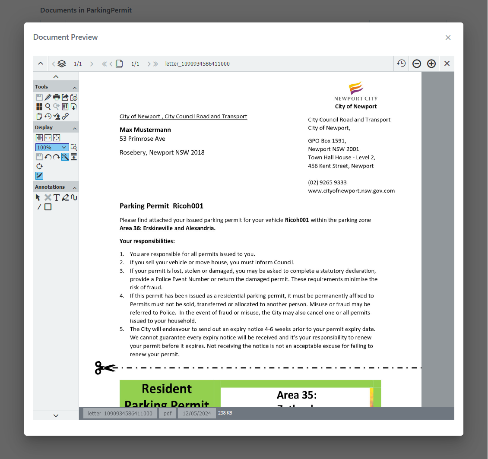
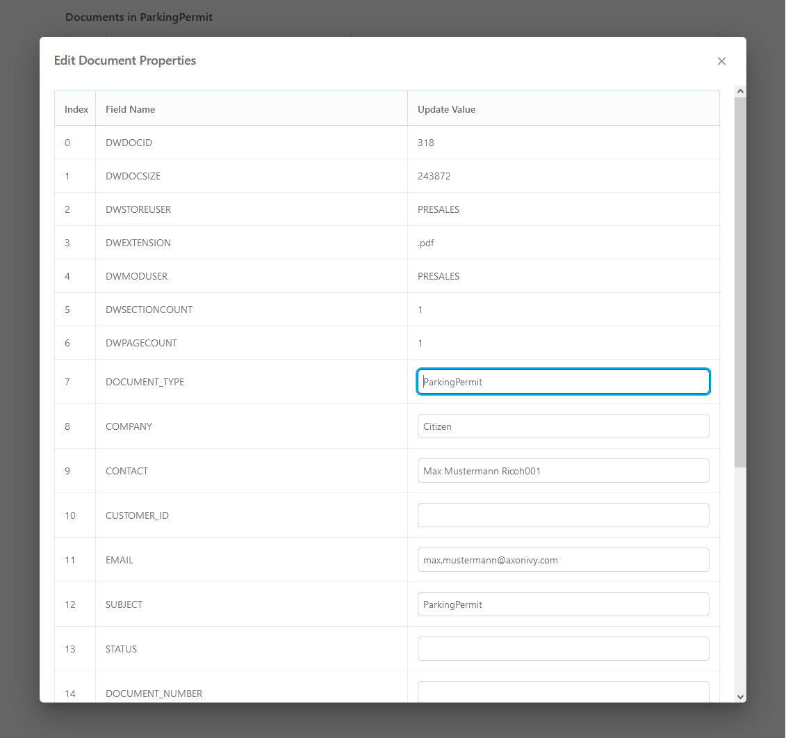

# DocuWare Connector

[DocuWare](https://start.docuware.com/) bietet cloudbasierte Software für
Dokumentenmanagement und Workflow-Automatisierung. Damit lassen sich alle
Geschäftsdokumente revisionssicher digitalisieren, archivieren und verarbeiten,
um die Kernprozesse Ihres Unternehmens zu optimieren.

Der Axon Ivy DocuWare-Konnektor ermöglicht die effiziente Integration von
DocuWare-Funktionen in Ihre Axon Ivy-Prozessanwendungen.

Dieser Konnektor:

- Minimiert Ihren Integrationsaufwand: Verwenden Sie die Demoversion, die
  Beispiele für die API-Aufrufe enthält.
- basiert auf REST-Webdiensttechnologien.
- gibt Ihnen Zugriff auf grundlegende DocuWare-Funktionen.

## Demo

### Funktionen

1. **Abrufen der Organisations-**Klicken Sie auf die Schaltfläche „
   **Organizations** ” (Organisations-ID abrufen), um die Organisations-ID
   abzurufen. Das System fügt diese ID automatisch in nachfolgende Anfragen ein.

   

2. **Abruf von Dateischränken**\
   Klicken Sie auf die Schaltfläche „ **“ (Dateischränke abrufen)**, um die
   Schrank-ID der ausgewählten Organisation abzurufen. Die Schrank-ID bestimmt,
   wohin die Datei hochgeladen wird.

   

3. **Dokument-Upload-**Wählen Sie eine Datei aus, die Sie in den ausgewählten
   DocuWare-Aktenschrank hochladen möchten. Sie können die hochgeladene Datei
   auf dem DocuWare-Dashboard überprüfen.

   

4. **Dokumentabruf**\
   Rufen Sie Dokumente automatisch ab, indem Sie die vordefinierten Felder „
   **“, „organization“** und „ **“ fileCabinetId** aus der Datei „
   `variables.yaml“` verwenden.

   Sie können auch die Organisation „ **“** und „ **“ fileCabinet** ändern,
   indem Sie den Filter „ **“** ändern. Beide Felder unterstützen die
   Mehrfachauswahl.

   

5. **Dokumentenanzeige-**Zeigen Sie Dokumente direkt in der Benutzeroberfläche
   mit dem Dokumentenbetrachter von DocuWare an.

   

6. **Bearbeiten von Dokumenteigenschaften**Ändern Sie Dokumenteigenschaften,
   einschließlich Metadaten und benutzerdefinierter Felder.

   

7. **Dokumententfernung**Löschen Sie Dokumente aus dem Aktenschrank.

   

Um Dokumente und deren Eigenschaften anzuzeigen und zu bearbeiten, führen Sie
den Prozess „ **“ aus. DocuWare-Dokument anzeigen/bearbeiten**.

Um Dokumente hochzuladen und Aktionen wie das Abrufen von Organisationen, das
Abrufen von Aktenschränken und das Hochladen von Dokumenten durchzuführen,
führen Sie den Prozess „ **” aus. Starten Sie einige DocuWare-Aufrufe „** ”.

## Einrichtung

Bevor Interaktionen zwischen der Axon Ivy Engine und den DocuWare-Diensten
ausgeführt werden können, müssen diese einander vorgestellt werden. Dies kann
wie folgt erfolgen:

1. `Erstellen Sie ein DocuWare-Konto und nutzen Sie den DocuWare-Cloud-Host `,
   `, Benutzername` und `, Passwort`.

2. Überschreiben Sie die globalen Variablen für `host`, `username` und
   `password` im Demo-Projekt, wie im folgenden Beispiel gezeigt.

```
@variables.yaml@
```

3. DocuWare unterstützt drei Möglichkeiten, um einen Zugriffstoken aus dem
   Identitätsdienst zu generieren:

   3.a Token per Benutzername und Passwort anfordern – GrantType ist „
   `password“`

   3.b Token über einen DocuWare-Token anfordern – GrantType ist `dwtoken`

   3.c Token per Benutzername und Passwort anfordern (vertrauenswürdiger
   Benutzer) – GrantType ist „ `trusted”`

4. Für GrantType ist `dwtoken`, wir müssen ein LoginToken erhalten. Bitte
   starten Sie den Prozess startRequestALoginToken.ivp und folgen Sie der
   Anleitung, um ein neues LoginToken zu generieren.

Wenn Ihre REST-URL nicht dem vordefinierten REST-URL-Muster dieses Konnektors
entspricht, können Sie die URL im Engine Cockpit ändern. Um die URL im Designer
zu ändern, müssen Sie das Konnektorprojekt entpacken und dort ändern.

Führen Sie „ `“ und „start.ivp“ aus, um „` “ des DocuWareDemo-Demo-Prozesses zu
testen und Ihre Einrichtung zu überprüfen.

